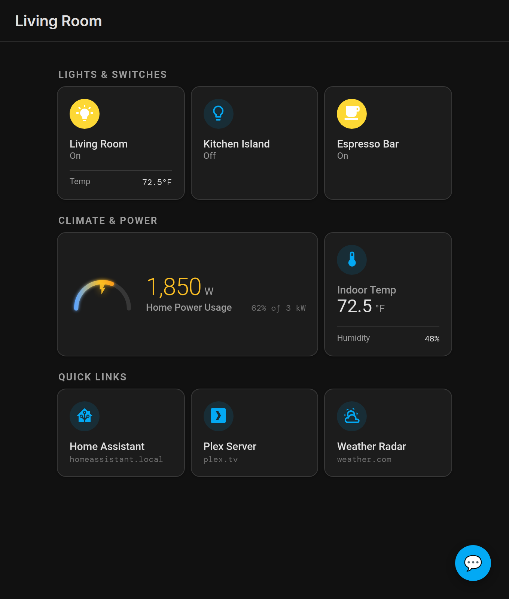
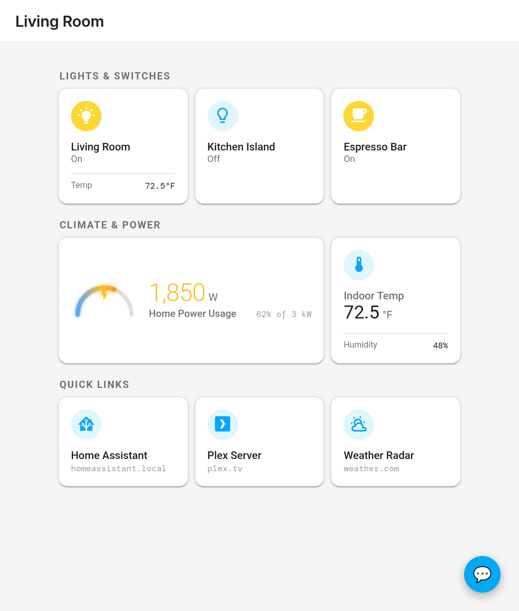
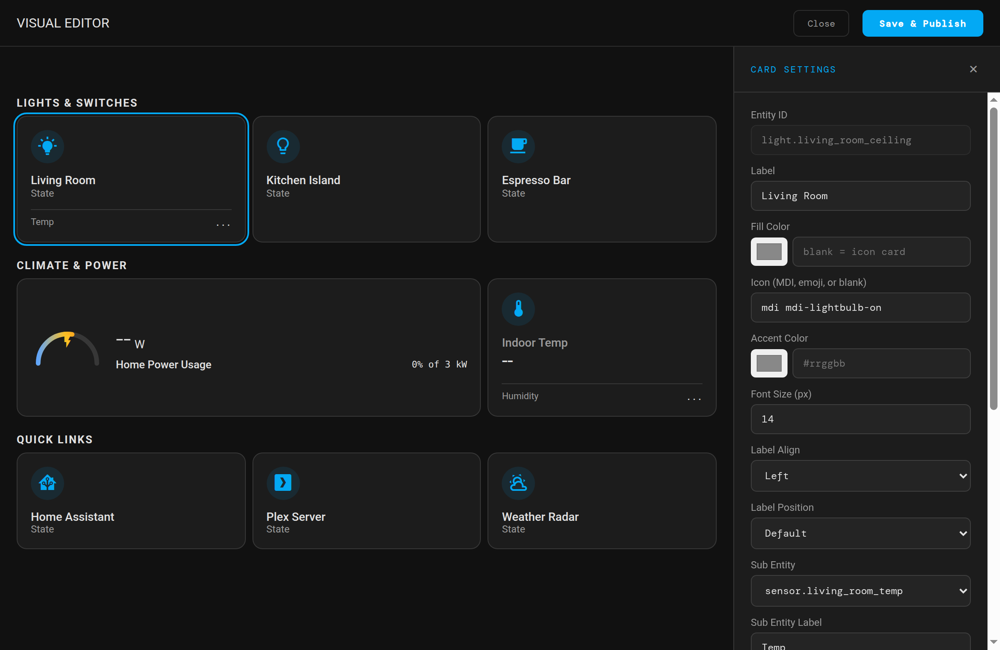

# HA-Public-Dash

A modern, lightweight dashboard for Home Assistant with a native **Lovelace UI** look and feel. It features a full-screen **WYSIWYG Visual Editor** for easy configuration and a public dashboard designed for shared spaces (tablets, kiosks, etc.) with no login required.

It's designed to be public-facing, but you must protect the /admin directory in your reverse proxy or set a secret to lock access to it. Information on this can be found below.

## Preview

| Dark Mode | Light Mode |
|:---:|:---:|
|  |  |

<br>



## Key Features

- **✨ Visual WYSIWYG Editor**: Click cards to edit properties in real-time with a live preview.
- **🎨 Lovelace Aesthetic**: Closely matches Home Assistant's native design language, including Light and Dark modes.
- **🏷️ Material Design Icons**: Full integration with the `@mdi/font` library for professional iconography.
- **💬 Feedback System**: Allow users to leave feedback directly from the dashboard, with persistent storage and optional Home Assistant notifications.
- **📦 Zero External Databases**: All configuration, feedback, and uploads are stored locally in a Docker volume.
- **🛠️ Flexible Layouts**: Responsive grid with adjustable column spans, label positions, and horizontal/vertical alignment.
- **🔗 Link Cards**: Add interactive links to other websites or services with favicon support.

## Quick Start

```bash
# 1. Clone the repository
git clone https://github.com/mitchsurp/HA-Public-Dash.git
cd HA-Public-Dash

# 2. Build & start using Docker Compose
docker compose up -d --build

# 3. Open the Admin Panel to configure your connection
open http://localhost:3002/admin/

# 4. View your Public Dashboard
open http://localhost:3002/
```

## Setup Guide

1. **Connect to Home Assistant**:
   - Go to the Admin Panel (`/admin/`).
   - Enter your Home Assistant URL and a **Long-Lived Access Token** (generated in HA under Profile → Long-Lived Access Tokens).
2. **Select Entities**:
   - Browse and search your HA entities and select the ones you want to display.
3. **Customize in Visual Editor**:
   - Click "✨ Open Visual Editor" to design your layout.
   - Click any card to customize its label, icon (MDI), colors, and alignment.
   - Assign **Sub Entities** to display secondary values (like temperature on a light switch).
4. **Save & Publish**:
   - Changes take effect immediately on the public dashboard.

## Configuration & Persistence

- **Port Mapping**: Default is `3002`. Change this in `docker-compose.yml` if needed.
- **Data Persistence**: All settings are saved in a Docker volume named `ha-public-dash-data`. To completely reset your installation, run `docker compose down -v`.

## Environment Variables

The application supports the following environment variables, which can be configured in `docker-compose.yml` under `environment:` or passed via `-e` in `docker run`:

| Variable | Required / Optional | Default | Description |
|:---|:---:|:---:|:---|
| `ADMIN_TOKEN` | Optional | *(none)* | A secret token used to protect the Admin Panel (`/admin/`) and admin API endpoints (`/api/admin/*`). When set, all admin requests require an `Authorization: Bearer <ADMIN_TOKEN>` header. You can enter this token in the Admin Panel under **Admin Security** so the UI automatically includes it in requests. If unset, the admin panel relies solely on network-level access control. |
| `PORT` | Optional | `3000` | The internal port the Express server listens on inside the container. If customized, update the container side of the port mapping in `docker-compose.yml` accordingly (e.g. `3002:<PORT>`). |
| `NODE_ENV` | Optional | `production` | Specifies the Node.js runtime environment (e.g., `production` or `development`). Setting this to `production` enables Express optimizations and suppresses verbose error stacks. |

> [!NOTE]
> Home Assistant connection details (HA instance URL and Long-Lived Access Token) are configured directly in the Admin Panel web UI and saved to the persistent `/data` volume, rather than passed as environment variables.

## Project Structure

```
.
├── backend/
│   ├── server.js          # Express API + HA Proxy + Feedback Logic
│   └── package.json
├── admin/
│   └── index.html         # WYSIWYG Admin Interface
├── frontend/
│   └── index.html         # Public Lovelace-style Dashboard
├── Dockerfile
├── docker-compose.yml
└── README.md
```

## Security Note

The admin panel (`/admin/`) is intended for local network use. It is recommended to use network-level access control or set the `ADMIN_TOKEN` environment variable for an extra layer of protection.
